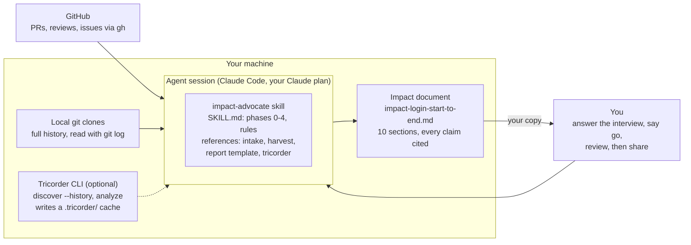

# Impact Advocate System Spec

*As of 2026-10-09 · skill version 0.1.3 · how-to: [IMPACT-ADVOCATE.md](IMPACT-ADVOCATE.md)*

Impact-advocate is an agent skill that turns one person's own GitHub record into an
evidence-led impact document, rated against their role and level, with optional ownership
and review evidence from tricorder. It runs inside the person's coding agent, needs no
AI-provider API key, and never assesses anyone but the person running it.

## Goals and non-goals

The system exists to make one person's impact case survive a skeptical reader, so every
claim it writes is linked or counted.

**Goals**

1. Interview the person, then harvest evidence from their own GitHub record over a window
   they choose.
2. Rate each expectation in their leveling guide, role description or OKRs as Exceeds,
   Meets, or Not visible in GitHub.
3. Write a Markdown document they can use in a self-review, promotion packet, or manager 1:1.
4. Point to tricorder evidence (ownership, review history) that raw counts miss, without
   needing an API key.

**Non-goals**

- Assessing anyone other than the person running it. Tricorder's
  [constitution §6](../CONSTITUTION.md#6-study-the-system-not-the-worth-of-the-people) rules
  out performance-review use, with a narrow self-directed exception this system lives under.
- Ranking, naming or quoting colleagues.
- Tricorder's team-level analysis (`learn`, `interpret`, `improve`, the explorer).
- Evidence that never touches GitHub (incidents, mentoring, design reviews). The document
  names these gaps instead of guessing.

## Architecture

The skill is a set of instructions; the person's agent does all the work, reading three
evidence sources and writing one file.

GitHub is the only remote source the skill reads. Everything else is local: clones, the
optional tricorder cache, and the output. On Claude.ai there are no local clones, so only
the GitHub half of the evidence is available.

## Components

The system has no server and no code of its own: it is instructions executed by the
person's agent against tools they already have.

| Component | What it is | Interface | Required? |
| --- | --- | --- | --- |
| Agent runtime | Claude Code (or Claude.ai, or any LLM chat) on the person's own plan | Loads the skill; runs shell commands; reads files | Yes |
| Skill: `SKILL.md` | The workflow, scope boundary and evidence rules ([source](../skills/impact-advocate/SKILL.md)) | Frontmatter `name` + `description` trigger it; `/impact-advocate` invokes it | Yes |
| Skill references | `intake.md`, `evidence-harvest.md`, `report-template.md`, `tricorder.md`, loaded per phase | Read by the agent when a phase says so | Yes |
| GitHub | PRs, reviews, issues, timing | `gh` CLI or `GITHUB_TOKEN` (read-only) | Strongly recommended |
| Local git clones | Commits, files, tests, co-author trailers, ownership | `git log`, full history (not shallow) | Yes |
| Tricorder CLI | `discover --history` and `analyze` only | Writes JSON under `.tricorder/` in the analyzed repo | Optional |
| Person | Supplies scope and yardstick, approves the run, reviews the output | Interview answers; "go"; the final check | Yes |
| Output | `impact-<login>-<start>-to-<end>.md` | A Markdown file in the agent's working directory | Produced |

## Workflow

Five phases run in order; nothing touches a repository until the person says "go" at the
end of phase 0.

| Phase | Input | What the agent does | Output | Gate |
| --- | --- | --- | --- | --- |
| 0. Interview | The person's request | Asks three rounds: scope and yardstick; what mattered; context the repo can't show. Skips anything already answered. Plays scope back in five lines or fewer. | Confirmed scope | Person says "go" (or "skip the interview": then every assumption is listed in the output) |
| 1. Harvest | Scope | Checks access (`gh auth status`, token, or git only). Runs `gh` and `git log` queries per the harvest reference. Logs the command behind every number. | Signals table + command log | None |
| 2. Rate | Signals + yardstick | Rates each expectation Exceeds / Meets / Not visible in GitHub. Each rating cites two pieces of evidence, or one plus a number. | Scorecard | None |
| 3. Write | Ratings + evidence | Fills the report template, outcome first. First person for a self-review, third for a manager brief. | `impact-….md` | None |
| 4. Point to tricorder | Thin or Not visible ratings | Names which ones `discover --history` and `analyze` could back up; offers to read `analyze`'s review cache. Runs nothing credentialed without consent. | Tailored suggestions | Person's consent before `analyze` |

After phase 4 the person reviews the document: open every link, re-run two or three
commands, confirm no colleague is named.

## Evidence model

The output is optimistic in tone and strict in what it claims; the rules below are what
make it survive a calibration committee.

**Ratings**

| Rating | Meaning | Required evidence |
| --- | --- | --- |
| Exceeds | Behavior or scope described at a higher level, or a clear margin over the team baseline (margin stated) | Two pieces, or one plus a number |
| Meets | The expected behavior at this level, repeatedly | Two pieces, or one plus a number |
| Not visible in GitHub | The repo can't show it either way | What evidence would show it |

There is no "below" rating: a repository shows that evidence exists far better than it
shows that a behavior is missing. Real gaps against the next level go in the Next-level gap
section as a plan.

**Claim rules** (labels follow [constitution §8](../CONSTITUTION.md#8-evidence-before-assertion))

1. Every claim is linked (PR, issue, commit SHA) or counted, with the command that produced
   the count.
2. Each claim is labelled `Observed:` (read straight from the record) or `Inferred:` (with
   its one-line reasoning).
3. No adjective without a number and its sample size.
4. Outcome first, then the activity that caused it.
5. Any number with n < 5 is flagged.
6. Nothing is fabricated: no link, metric, quote, OKR or ladder text that isn't in the
   record or the interview.
7. Co-authored and AI-assisted commits are counted as the person's work and disclosed in the
   methodology.

**Baselines.** The same metric for all contributors in the same repos and window, bots
excluded, reported as an anonymous median and p75. In a single-contributor repo the document
says there is no baseline and treats sole ownership as a scope claim.

## Data and trust boundaries

Data moves only between GitHub, the person's machine and their own agent session (which runs
on Claude); no separate AI provider or API key is involved.

| Data | Read from | Access needed | Stored | Goes to |
| --- | --- | --- | --- | --- |
| Commits, files, trailers | Local clones | None | Not stored | Agent session |
| PRs, reviews, comments, issues | GitHub | `gh` sign-in or read-only token | Not stored by the skill | Agent session |
| Ownership, hotspots, timeline | `tricorder discover --history` | None | `.tricorder/` in the repo | Agent session, if read |
| Review observations, expertise map, raw reviews and inline comments | `tricorder analyze` | `gh` sign-in or token | `.tricorder/OWNER__REPO/` and `.raw/reviews/`, `.raw/comments/` | Agent session, if read |
| Ladder, role description, OKRs | The person | None | Not stored | Agent session |
| Impact document | Agent output | None | Working directory | Whoever the person shares it with |

- **Colleagues' data** is read (their reviews of the person's PRs, team baselines) but never
  named, ranked or quoted in the output.
- **`.tricorder/`** contains colleagues' logins and comment text: excluded from git
  (`.git/info/exclude`), kept local.
- **Writes** are limited to the output file and `.tricorder/`. The skill never pushes,
  comments or opens anything on GitHub.

## Interfaces

The system takes twelve interview answers and produces one Markdown file with ten sections.

**Input: the interview** ([intake.md](../skills/impact-advocate/references/intake.md))

| Round | Fields |
| --- | --- |
| 1. Scope and yardstick | Lookback window · GitHub logins and every commit email · Repos (discover all, or a list; exclusions) · Level to assess against (current or next) · Leveling guide or ladder · KPIs / OKRs |
| 2. What mattered | The 2–4 pieces of work they're proudest of · Role description and explicit expectations |
| 3. Context | Audience · Conventions that skew counts (squash merges, stacked PRs, bots) · How to describe AI and co-authored commits · Off-GitHub impact to look for |

**Output: the document** ([report-template.md](../skills/impact-advocate/references/report-template.md)),
sections in this order:

1. Headline: 3–5 sentences, each with a number and a link
2. Scorecard: expectation · rating · strongest evidence · Observed or Inferred
3. Where I exceed my level: situation, what I did, measurable result
4. Where I meet my level
5. Contribution to goals: OKR or KPI · target · PRs and issues · evidence of movement
6. By the numbers: metric · me · team median (p75) · n · command
7. Not visible in GitHub: each gap and what to bring instead
8. Next-level gap (promotion cases only)
9. Strengthen this with tricorder
10. Appendix: methodology (window, identities, repos, access, conventions, co-authorship,
    small-sample flags)

**Invocation.** Natural-language request, or `/impact-advocate` in Claude Code. Install path:
`~/.claude/skills/impact-advocate/` (personal) or `.claude/skills/impact-advocate/` (one
repo).

## Degraded modes and failure handling

The system degrades by reporting what it couldn't see, never by filling the gap with
inference.

| Condition | Behavior |
| --- | --- |
| No `gh` or token (git only) | Harvests commits, PR numbers from merge/squash subjects, files, tests, ownership. Rates review-related expectations Not visible; methodology states what access hid. |
| Shallow clone | Checks `git rev-parse --is-shallow-repository`; deepens with `git fetch --shallow-since` before counting. |
| Missing commit email | Counts silently undercount; prevented by asking for every email in the interview. |
| No leveling guide | Offers a public ladder the person picks, or the role description alone; labels every rating with its yardstick. Never reconstructs an employer ladder from memory. |
| Single-contributor repo | No baseline; says so; sole ownership becomes a scope claim. |
| Person skips the interview | Proceeds on stated defaults; lists every assumption at the top of the document. |
| `gh search` hits its 1,000-result cap | Splits the window into smaller ranges. |
| Asked to assess someone else | Declines and explains the constitution's limit; points to tricorder's team-level analysis instead. |
| Tricorder not installed | Skips phase 4's commands; the document still stands on `gh` and git evidence. |

## Validation status and known gaps

The skill beat a strong one-off prompt on evidence discipline (83% vs 61% of checks
passed), but the test was small and self-graded.

| Test | With skill | Without skill | Note |
| --- | --- | --- | --- |
| Interview before acting | 4/6 | 4/6 | Each missed different questions |
| Full run, tricorder repo, git only | 9/9 | 5/9 | Without the skill: no Observed/Inferred labels; reported 49 AI co-author trailers where the log shows 20 |

**Gaps**

- [ ] Re-test after the interview change (yardstick moved to round 1, proudest-work question
      added): not yet run.
- [ ] Test on a multi-contributor repo with `gh` access, with an independent grader: not yet
      run.
- [ ] Report template: carry over the "why it mattered" storytelling the run without the
      skill did better.
- [ ] Oversight density (share of silent approvals) is computed only inside
      `tricorder learn`, which needs a key; moving it into `analyze` would make it available
      here.
- [ ] Claude.ai upload of the skill: not tried end to end.
- [ ] Trigger description not tuned with skill-creator's description optimizer.
