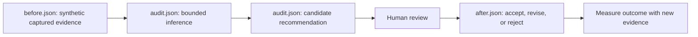
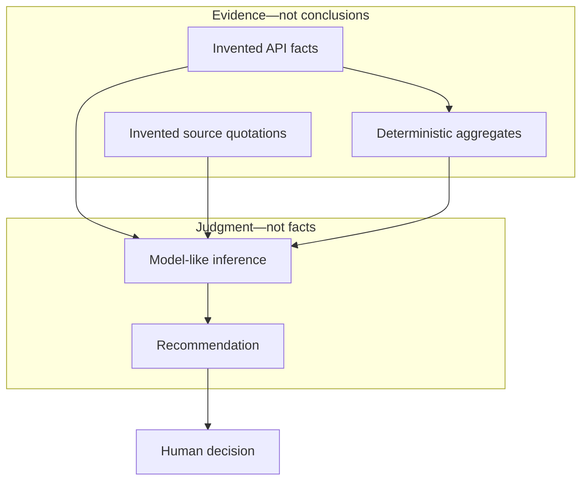

# Synthetic review audit

> **Entirely synthetic.** The repository, people, pull requests, quotations, dates,
> and findings in this case study were invented for this example. They are not an
> anonymized or transformed real Tricorder run.

This small case demonstrates how to keep captured evidence separate from inference
and recommendations. It is a teaching fixture, not a personnel assessment.

- [`before.json`](./before.json) contains invented API-like facts and source text.
- [`audit.json`](./audit.json) makes each inference traceable to evidence and records
  alternatives and confidence limits.
- [`after.json`](./after.json) records which recommendation was accepted, revised, or
  rejected and what evidence would measure the outcome.
- [`index.html`](./index.html) provides a compact stage-by-stage viewer.

## Explore without credentials

No GitHub token, model key, network request, or live Tricorder run is needed. From
the repository root, serve the checked-in static files:

```bash
python3 -m http.server 8000
```

Open
`http://localhost:8000/docs/case-studies/synthetic-review-audit/`.
You can also read the JSON directly. The server only reads local checked-in files.

## Pipeline



## Evidence boundary



## Walkthrough

The synthetic sample contains three pull requests. Two omit rollback notes. That
count is deterministic within the fixture, but the explanation for the omission is
not observable. The audit therefore offers a low-confidence process hypothesis,
lists plausible alternatives, and recommends a reversible template experiment—not
a judgment about a person.

The after stage narrows the proposal to a two-week trial and defines a measure. It
also rejects an individual ranking because the evidence cannot support it.

## Limitations and responsible use

- Three invented PRs cannot establish a general pattern or causal explanation.
- Missing written evidence is not evidence that discussion or review did not occur.
- Confidence labels are illustrative, not calibrated probabilities.
- Recommendations require owner review, current context, and proportionality.
- Do not repurpose Tricorder output for performance review, hiring, promotion,
  compensation, discipline, employee ranking, or claims about competence or intent.
- Real review content and identities may cross provider and local-retention
  boundaries during `learn`, `interpret`, and `improve`; read
  [Privacy and data flow](../../PRIVACY.md) before using those commands.

This case study coordinates with a private remediation tracked by
[`dhk/tricorder_graphene#1`](https://github.com/dhk/tricorder_graphene/issues/1).
That link discloses no private-run content.
